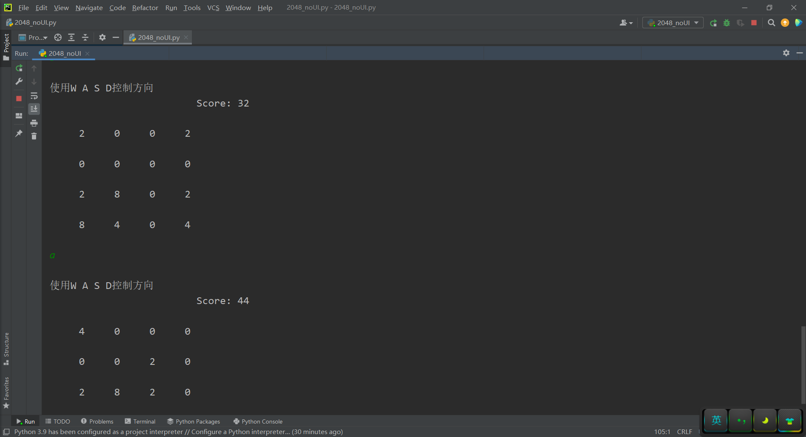
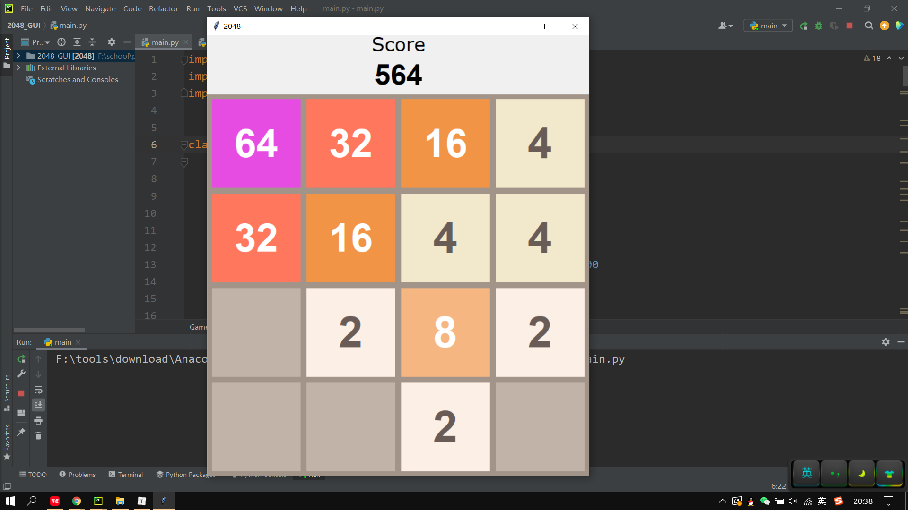
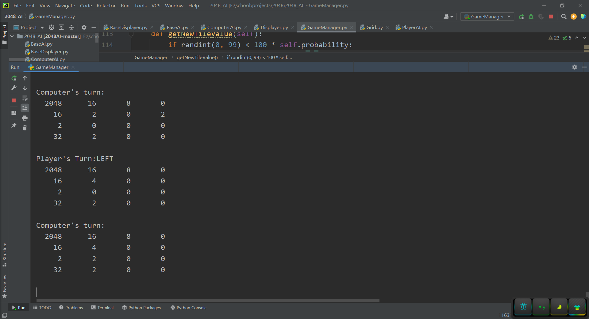

# 2048及其AI模式实现（底层逻辑及算法优化、GUI界面编程、Minimax算法实现AI）


## ==如何运行：==

1. 运行非AI模式：

   ​	直接运行2048/2048_noUI.py

   

2. 运行带有GUI界面，但非AI的模式：

   ​	打开2048_GUI工程，运行2048/2048_GUI_main.py

   

3. 运行AI模式：

   ​	打开2048_AI工程，运行2048/2048_AI/GameManager.py	


## 基于Python完成以下三个任务：

1. 实现2048底层逻辑
2. 完成GUI设计并实现
3. 让机器学会玩2048，并获得游戏胜利（最大方块达到2048）


## 2048底层逻辑

### 自顶向下拆分各个功能板块：

1. 随机在空白位置生成两个方块；
2. 刷新界面并展示矩阵；
3. 接收玩家操作；
4. 计算玩家操作后得到的新矩阵，并计算该步得分；
5. 判断游戏结束。

### 各个功能间逻辑关系：

​	游戏开始->

​	1->2->5->3->4->

​	1->2->5->3->4->...

​	1->2->5->3->4->游戏结束->给出分数

### 算法优化：

​	考虑到玩家向上、向下、向左、向右的操作在逻辑上具有高度一致性，可以考虑只实现一个方向的功能，比如左。其他的方向可以利用矩阵旋转，转化为左方向。

​	比如，程序接收到用户向上操作的指令时，可以将矩阵逆时针旋转90°，转化为向左操作。

### 综上，详细介绍各个功能模块的实现细节：

1. 展示矩阵：

   ```python
   def show(M):
       print("\n" + "使用W A S D控制方向", end="")
       print("\n" + " " * 25 + "Score: " + "{:}".format(score), end="")
       for i in range(SIZE):
           print("\n")
           for j in range(SIZE):
               print("{: >6}".format(M[i][j]), end="")
       print("\n")
   ```

   

2. 随机位置生成两个方块：

   ```python
   def add(M):
       numOfZero = 0
       cnt = 0
       for r in range(SIZE):
           for c in range(SIZE):
               if M[r][c] == 0:
                   numOfZero += 1
       if numOfZero >= 2:
           numOfZero = 2
       while True:
           p = random.randint(0, SIZE * SIZE - 1)
           if M[p // SIZE][p % SIZE] == 0:
               x = random.choice([2, 2, 2, 4])
               M[p // SIZE][p % SIZE] = x
               cnt += 1
           if cnt == numOfZero:
               break
       return M
   ```

   

3. 接收玩家操作并将该操作转化为向左：

   ```python
   def moveUp():
       global map
       map = rotate90(map)  # 先逆时针旋转90度，原本向上的操作变成了向左操作，这时就可以调用caculate函数。
       if caculate(map)[1]:
           map = add(map)
       map = rotate90(map)
       map = rotate90(map)
       map = rotate90(map)  # 操作完成后再旋转3个90度，总共旋转360度，矩阵方向不变。
   
   
   def moveRight():
       global map
       map = rotate90(map)
       map = rotate90(map)
       if caculate(map)[1]:
           map = add(map)
       map = rotate90(map)
       map = rotate90(map)
   
   
   def moveDown():
       global map
       map = rotate90(map)
       map = rotate90(map)
       map = rotate90(map)
       if caculate(map)[1]:
           map = add(map)
       map = rotate90(map)
   
   
   def moveLeft():
       global map
       if caculate(map)[1]:
           map = add(map)
   ```

   

4. 矩阵逆时针旋转90°：

   ```python
   def rotate90(M):
       M = [[M[c][r] for c in range(SIZE)] for r in reversed(range(SIZE))]
       return M
   ```

   

5. 计算玩家操作后的矩阵状态（仅支持向左）并更新分数：

   ```python
   def caculate(M):
       global score
       changed = False
       for a in M:
           b = []
           last = 0
           for v in a:
               if v != 0:
                   if v == last:
                       s = b.pop() * 2
                       b.append(s)
                       score += s
                       last = 0
                   else:
                       b.append(v)
                       last = v
           b += [0] * (SIZE - len(b))  # 弥补本行剩下的元素
           for i in range(SIZE):
               if a[i] != b[i]:
                   changed = True
           a[:] = b
       return M, changed
   ```

   

6. 判断游戏结束：

   ```python
   def over(M):
       for r in range(SIZE):
           for c in range(SIZE):
               if M[r][c] == 0:
                   return False
       for r in range(SIZE):
           for c in range(SIZE - 1):
               if M[r][c] == M[r][c + 1]:
                   return False
       for r in range(SIZE - 1):
           for c in range(SIZE):
               if M[r][c] == M[r + 1][c]:
                   return False
       return True
   ```

   

   ### 初始化和主函数：

   ```python
   import random
   
   # 矩阵大小（游戏难度）
   SIZE = 4
   
   # map存储矩阵中的数字
   map = [[0 for i in range(SIZE)] for i in range(SIZE)]
   
   # 游戏分数
   score = 0
   
   map = add(map)
   show(map)
   
   while not over(map):
       cmd = input()
       if cmd == "w":
           moveUp()
       if cmd == 's':
           moveDown()
       if cmd == 'a':
           moveLeft()
       if cmd == 'd':
           moveRight()
       show(map)
       
   print("Game Over!\nYour score is: ", end='')
   print(score)
   ```

   ### 运行界面：

   


## GUI界面编程

为2048封装GUI界面，不涉及非常困难的技术问题，参照GUI文档完成任务。

```python
# main.py
# main file
import random
import tkinter as tk
import colors as c


class Game(tk.Frame):
    def __init__(self):
        tk.Frame.__init__(self)
        self.grid()
        self.master.title("2048")

        self.main_grid = tk.Frame(
            self, bg=c.GRID_COLOR, bd=3, width=600, height=600
        )
        self.main_grid.grid(pady=(100, 0))
        self.make_GUI()
        self.start_game()
        self.master.bind("<Left>", self.left)
        self.master.bind("<Right>", self.right)
        self.master.bind("<Up>", self.up)
        self.master.bind("<Down>", self.down)
        self.mainloop()

    def make_GUI(self):
        # make grid
        self.cells = []
        for i in range(4):
            row = []
            for j in range(4):
                cell_frame = tk.Frame(
                    self.main_grid,
                    bg=c.EMPTY_CELL_COLOR,
                    width=150,
                    height=150
                )
                cell_frame.grid(row=i, column=j, padx=5, pady=5)
                cell_number = tk.Label(self.main_grid, bg=c.EMPTY_CELL_COLOR)
                cell_number.grid(row=i, column=j)
                cell_data = {"frame": cell_frame, "number": cell_number}
                row.append(cell_data)
            self.cells.append(row)

        score_frame = tk.Frame(self)
        score_frame.place(relx=0.5, y=45, anchor="center")
        tk.Label(
            score_frame,
            text="Score",
            font=c.SCORE_LABEL_FONT
        ).grid(row=0)
        self.score_label = tk.Label(score_frame, text="0", font=c.SCORE_FONT)
        self.score_label.grid(row=1)

    def start_game(self):
        self.matrix = [[0] * 4 for _ in range(4)]

        row = random.randint(0, 3)
        col = random.randint(0, 3)
        self.matrix[row][col] = 2
        self.cells[row][col]["frame"].configure(bg=c.CELL_COLORS[2])
        self.cells[row][col]["number"].configure(
            bg=c.CELL_COLORS[2],
            fg=c.CELL_NUMBER_COLORS[2],
            font=c.CELL_NUMBER_FONTS[2],
            text="2"
        )
        while (self.matrix[row][col] != 0):
            row = random.randint(0, 3)
            col = random.randint(0, 3)
        self.matrix[row][col] = 2
        self.cells[row][col]["frame"].configure(bg=c.CELL_COLORS[2])
        self.cells[row][col]["number"].configure(
            bg=c.CELL_COLORS[2],
            fg=c.CELL_NUMBER_COLORS[2],
            font=c.CELL_NUMBER_FONTS[2],
            text="2"
        )

        self.score = 0

    def stack(self):
        new_matrix = [[0] * 4 for _ in range(4)]
        for i in range(4):
            fill_position = 0
            for j in range(4):
                if self.matrix[i][j] != 0:
                    new_matrix[i][fill_position] = self.matrix[i][j]
                    fill_position += 1
        self.matrix = new_matrix

    def combine(self):
        for i in range(4):
            for j in range(3):
                if self.matrix[i][j] != 0 and self.matrix[i][j] == self.matrix[i][j + 1]:
                    self.matrix[i][j] *= 2
                    self.matrix[i][j + 1] = 0
                    self.score += self.matrix[i][j]

    def reverse(self):
        new_matrix = []
        for i in range(4):
            new_matrix.append([])
            for j in range(4):
                new_matrix[i].append(self.matrix[i][3 - j])
        self.matrix = new_matrix

    def transpose(self):
        new_matrix = [[0] * 4 for _ in range(4)]
        for i in range(4):
            for j in range(4):
                new_matrix[i][j] = self.matrix[j][i]
        self.matrix = new_matrix

    def add_new_tile(self):
        row = random.randint(0, 3)
        col = random.randint(0, 3)
        while (self.matrix[row][col] != 0):
            row = random.randint(0, 3)
            col = random.randint(0, 3)
        self.matrix[row][col] = random.choice([2, 4])

    def update_GUI(self):
        for i in range(4):
            for j in range(4):
                cell_value = self.matrix[i][j]
                if cell_value == 0:
                    self.cells[i][j]["frame"].configure(bg=c.EMPTY_CELL_COLOR)
                    self.cells[i][j]["number"].configure(bg=c.EMPTY_CELL_COLOR, text="")
                else:
                    self.cells[i][j]["frame"].configure(bg=c.CELL_COLORS[cell_value])
                    self.cells[i][j]["number"].configure(
                        bg=c.CELL_COLORS[cell_value],
                        fg=c.CELL_NUMBER_COLORS[cell_value],
                        font=c.CELL_NUMBER_FONTS[cell_value],
                        text=str(cell_value)
                    )
        self.score_label.configure(text=self.score)
        self.update_idletasks()

    # These code for ordinary mode
    def left(self, event):
        self.stack()
        self.combine()
        self.stack()
        self.add_new_tile()
        self.update_GUI()
        self.game_over()

    def right(self, event):
        self.reverse()
        self.stack()
        self.combine()
        self.stack()
        self.reverse()
        self.add_new_tile()
        self.update_GUI()
        self.game_over()

    def up(self, event):
        self.transpose()
        self.stack()
        self.combine()
        self.stack()
        self.transpose()
        self.add_new_tile()
        self.update_GUI()
        self.game_over()

    def down(self, event):
        self.transpose()
        self.reverse()
        self.stack()
        self.combine()
        self.stack()
        self.reverse()
        self.transpose()
        self.add_new_tile()
        self.update_GUI()
        self.game_over()

    def horizontal_move_exists(self):
        for i in range(4):
            for j in range(3):
                if self.matrix[i][j] == self.matrix[i][j + 1]:
                    return True
        return False

    def vertical_move_exists(self):
        for i in range(3):
            for j in range(4):
                if self.matrix[i][j] == self.matrix[i + 1][j]:
                    return True
        return False

    def game_over(self):
        if any(2048 in row for row in self.matrix):
            game_over_frame = tk.Frame(self.main_grid, borderwidth=2)
            game_over_frame.place(relx=0.5, rely=0.5, anchor="center")
            tk.Label(
                game_over_frame,
                text="You win!",
                bg=c.WINNER_BG,
                fg=c.GAME_OVER_FONT_COLOR,
                font=c.GAME_OVER_FONT
            ).pack()
        elif not any(0 in row for row in self.matrix) \
                and not self.horizontal_move_exists() \
                and not self.vertical_move_exists():
            game_over_frame = tk.Frame(self.main_grid, borderwidth=2)
            game_over_frame.place(relx=0.5, rely=0.5, anchor="center")
            tk.Label(
                game_over_frame,
                text="Game over!",
                bg=c.LOSER_BG,
                fg=c.GAME_OVER_FONT_COLOR,
                font=c.GAME_OVER_FONT
            ).pack()

def main():
    Game()

if __name__ == "__main__":
    main()
```

```python
# color.py
# config file
GRID_COLOR = "#a39489"
EMPTY_CELL_COLOR = "#c2b3a9"
SCORE_LABEL_FONT = ("Verdana", 24)
SCORE_FONT = ("Helvetica", 36, "bold")
GAME_OVER_FONT = ("Helvetica", 48, "bold")
GAME_OVER_FONT_COLOR = "#ffffff"
WINNER_BG = "#ffcc00"
LOSER_BG = "#a39489"

CELL_COLORS = {
    2:"#fcefe6",
    4:"#f2e8cb",
    8:"#f5b682",
    16:"#f29446",
    32:"#ff775c",
    64:"#e64ce2",
    128:"#ede291",
    256:"#fce130",
    512:"#ffdb4a",
    1024:"#f0b922",
    2048:"#fad74d"
}

CELL_NUMBER_COLORS = {
    2:"#695c57",
    4:"#695c57",
    8:"#ffffff",
    16:"#ffffff",
    32:"#ffffff",
    64:"#ffffff",
    128:"#ffffff",
    256:"#ffffff",
    512:"#ffffff",
    1024:"#ffffff",
    2048:"#ffffff"
}

CELL_NUMBER_FONTS = {
    2:("Helvetica", 55, "bold"),
    4:("Helvetica", 55, "bold"),
    8:("Helvetica", 55, "bold"),
    16:("Helvetica", 50, "bold"),
    32:("Helvetica", 50, "bold"),
    64:("Helvetica", 50, "bold"),
    128:("Helvetica", 45, "bold"),
    256:("Helvetica", 45, "bold"),
    512:("Helvetica", 45, "bold"),
    1024:("Helvetica", 40, "bold"),
    2048:("Helvetica", 40, "bold")
}
```

运行界面：




## AI模式的实现

下面讨论使用Minimax算法完成人工智能模式，使得机器能够自我运行2048.

对于Minimax算法，其他文章有详细介绍。

Minimax是双人对弈模型中的经典算法。而2048可以看做玩家和计算机之间的博弈。玩家希望找出四个方向中的最佳方向，使得格局尽可能最优；而计算机希望在某特定位置生成随机方块，使得玩家格局尽可能最差。并且，玩家和计算机轮流行动。所以2048可以抽象为双人对弈模型。

在本项目中，影响格局的因素有如下几点：

1. 同行、同列内方块保持递增或者递减（单调性）；
2. 相邻方块数值差异小（平滑性）；
3. 矩阵中的空格数量（空格数）；
4. 矩阵中的最大值（最大数）。

在设计估值函数时，需要考虑以上要素，并经过多次调试，确定最佳权重参数，完成对估值函数的设计。

在程序运行过程中，利用估值函数，构建格局树，并通过DFS找到最优格局。

从理论上说，只要估值函数设计合理，程序可以一直运行下去，游戏很难结束。但是，实际中由于对格局的影响因素考虑不全、权重参数并非最佳等原因，导致估值函数并非理想。

但是运行到2048问题不大。程序运行结果如下：



已经到2048了，但是可以看出来格局依然很好，跑到4096也是轻轻松松。

仔细回顾AI的思路，发现和我们平时玩2048的高分思路一致，都是把最大数放到一角，次大数放在旁边。


源代码如下：

```python
# BaseDisplayer.py
class BaseDisplayer:
    def __init__(self):
        pass

    def display(self, grid):
        pass

```

```python
# BaseAI.py
class BaseDisplayer:
    def __init__(self):
        pass

    def display(self, grid):
        pass

```

```python
# ComputerAI.py
from random import randint
from BaseAI import BaseAI

class ComputerAI(BaseAI):
    def getMove(self, grid):
        cells = grid.getAvailableCells()

        return cells[randint(0, len(cells) - 1)] if cells else None

```

```python
# PlayerAI.py
from random import randint
from BaseAI import BaseAI
from pdb import set_trace
import time

timeLimit = 0.2

def h(grid):
    return hash(tuple([tuple(x) for x in grid.map]))
    
class PlayerAI(BaseAI):
    
    def getMove(self, grid):
        ''' 
            UP 0
            DOWN 1
            LEFT 2
            RIGHT 3
        '''
        self.startTime = time.clock()
        self.depthLimit = 6
        self.heuristics = dict()
        self.childrenMax = dict()
        self.childrenMin = dict()
        bestMove = None
        while not self.timeOver():
            move, _, _ = self.maximize(grid, float('-inf'), float('inf'), 1)
            self.depthLimit +=1
            if not self.timeOver() or bestMove is None:
                bestMove = move
        return bestMove
        
    def maximize(self, grid, alpha, beta, depth):
        if self.timeOver() or depth > self.depthLimit:
                return None, None, self.evaluation(grid)

        key = h(grid)
        if key not in self.childrenMax:
            moves = grid.getAvailableMoves()
            if not moves:
                return None, None, self.evaluation(grid)
            children = []
            for move in moves:
                child = grid.clone()
                child.move(move)
                children.append([child, move])
            self.childrenMax[key] = children
        maxChild, maxUtility = None, float('-inf')

        for child in self.childrenMax[key]:
            _, _, utility = self.minimize(child[0], alpha, beta, depth + 1)

            if utility > maxUtility:
                bestMove, maxChild, maxUtility = child[1], child[0], utility

            if maxUtility >= beta:
                break

            if maxUtility > alpha:
                alpha = maxUtility

        return bestMove, maxChild, maxUtility

    def minimize(self, grid, alpha, beta, depth):
        if self.timeOver() or depth > self.depthLimit:
            return None, None, self.evaluation(grid)

        key = h(grid)
        if key not in self.childrenMin:
            cells = grid.getAvailableCells()
            if not cells:
                return None, None, self.evaluation(grid)
            children = []
            for cell in cells:
                child = grid.clone()
                child.insertTile(cell, 2)
                children.append(child)
            for cell in cells:
                child = grid.clone()
                child.insertTile(cell, 4)
                children.append(child)
            self.childrenMin[key] = children

        minChild, minUtility = None, float('inf')

        for child in self.childrenMin[key]:
            _, _, utility = self.maximize(child, alpha, beta, depth + 1)

            if utility < minUtility:
                _, minChild, minUtility = _, child, utility

            if minUtility <= alpha:
                break

            if minUtility < beta:
                beta = minUtility

        return _, minChild, minUtility

    def evaluation(self, grid):
        key = h(grid)
        if key in self.heuristics:
            return self.heuristics[key]

        score = 0
        for i in range(4):
            for j in range(4):
                score += grid.map[i][j] * (6-i-j)
        #freeTiles = len(grid.getAvailableCells())
        #score -= score/(freeTiles+1)

        if not grid.canMove():
            lostPenalty = 2 * grid.getMaxTile()
            score -= lostPenalty

        self.heuristics[key] = score
        return score
        
    def timeOver(self):
        return self.startTime + timeLimit <= time.clock()
```

```python
# Displayer.py
from BaseDisplayer import BaseDisplayer
import platform
import os

colorMap = {
    0 	  : 97 ,
    2     : 40 ,
    4     : 100,
    8     : 47 ,
    16    : 107,
    32    : 46 ,
    64    : 106,
    128   : 44 ,
    256   : 104,
    512   : 42 ,
    1024  : 102,
    2048  : 43 ,
    4096  : 103,
    8192  : 45 ,
    16384 : 105,
    32768 : 41 ,
    65536 : 101,
}

cTemp = "\x1b[%dm%7s\x1b[0m "

class Displayer(BaseDisplayer):
    def __init__(self):
        if "Windows" == platform.system():
            self.display = self.winDisplay
        else:
            self.display = self.unixDisplay

    def display(self, grid):
        pass

    def winDisplay(self, grid):
        for i in range(grid.size):
            for j in range(grid.size):
                print("%6d  " % grid.map[i][j], end="")
            print("")
        print("")

    def unixDisplay(self, grid):
        for i in range(3 * grid.size):
            for j in range(grid.size):
                v = grid.map[int(i / 3)][j]

                if i % 3 == 1:
                    string = str(v).center(7, " ")
                else:
                    string = " "

                print(cTemp %  (colorMap[v], string), end="")
            print("")

            if i % 3 == 2:
                print("")
```

```python
# Grid.py
from copy import deepcopy

directionVectors = (UP_VEC, DOWN_VEC, LEFT_VEC, RIGHT_VEC) = ((-1, 0), (1, 0), (0, -1), (0, 1))
vecIndex = [UP, DOWN, LEFT, RIGHT] = range(4)

class Grid:
    def __init__(self, size = 4):
        self.size = size
        self.map = [[0] * self.size for i in range(self.size)]

    # Make a Deep Copy of This Object
    def clone(self):
        gridCopy = Grid()
        gridCopy.map = deepcopy(self.map)
        gridCopy.size = self.size

        return gridCopy

    # Insert a Tile in an Empty Cell
    def insertTile(self, pos, value):
        self.setCellValue(pos, value)

    def setCellValue(self, pos, value):
        self.map[pos[0]][pos[1]] = value

    # Return All the Empty c\Cells
    def getAvailableCells(self):
        cells = []

        for x in range(self.size):
            for y in range(self.size):
                if self.map[x][y] == 0:
                    cells.append((x,y))

        return cells

    # Return the Tile with Maximum Value
    def getMaxTile(self):
        maxTile = 0

        for x in range(self.size):
            for y in range(self.size):
                maxTile = max(maxTile, self.map[x][y])

        return maxTile

    # Check If Able to Insert a Tile in Position
    def canInsert(self, pos):
        return self.getCellValue(pos) == 0

    # Move the Grid
    def move(self, dir):
        dir = int(dir)

        if dir == UP:
            return self.moveUD(False)
        if dir == DOWN:
            return self.moveUD(True)
        if dir == LEFT:
            return self.moveLR(False)
        if dir == RIGHT:
            return self.moveLR(True)

    # Move Up or Down
    def moveUD(self, down):
        r = range(self.size -1, -1, -1) if down else range(self.size)

        moved = False

        for j in range(self.size):
            cells = []

            for i in r:
                cell = self.map[i][j]

                if cell != 0:
                    cells.append(cell)

            self.merge(cells)

            for i in r:
                value = cells.pop(0) if cells else 0

                if self.map[i][j] != value:
                    moved = True

                self.map[i][j] = value

        return moved

    # move left or right
    def moveLR(self, right):
        r = range(self.size - 1, -1, -1) if right else range(self.size)

        moved = False

        for i in range(self.size):
            cells = []

            for j in r:
                cell = self.map[i][j]

                if cell != 0:
                    cells.append(cell)

            self.merge(cells)

            for j in r:
                value = cells.pop(0) if cells else 0

                if self.map[i][j] != value:
                    moved = True

                self.map[i][j] = value

        return moved

    # Merge Tiles
    def merge(self, cells):
        if len(cells) <= 1:
            return cells

        i = 0

        while i < len(cells) - 1:
            if cells[i] == cells[i+1]:
                cells[i] *= 2

                del cells[i+1]

            i += 1

    def canMove(self, dirs = vecIndex):

        # Init Moves to be Checked
        checkingMoves = set(dirs)

        for x in range(self.size):
            for y in range(self.size):

                # If Current Cell is Filled
                if self.map[x][y]:

                    # Look Ajacent Cell Value
                    for i in checkingMoves:
                        move = directionVectors[i]

                        adjCellValue = self.getCellValue((x + move[0], y + move[1]))

                        # If Value is the Same or Adjacent Cell is Empty
                        if adjCellValue == self.map[x][y] or adjCellValue == 0:
                            return True

                # Else if Current Cell is Empty
                elif self.map[x][y] == 0:
                    return True

        return False

    # Return All Available Moves
    def getAvailableMoves(self, dirs = vecIndex):
        availableMoves = []

        for x in dirs:
            gridCopy = self.clone()

            if gridCopy.move(x):
                availableMoves.append(x)

        return availableMoves

    def crossBound(self, pos):
        return pos[0] < 0 or pos[0] >= self.size or pos[1] < 0 or pos[1] >= self.size

    def getCellValue(self, pos):
        if not self.crossBound(pos):
            return self.map[pos[0]][pos[1]]
        else:
            return None

if __name__ == '__main__':
    g = Grid()
    g.map[0][0] = 2
    g.map[1][0] = 2
    g.map[3][0] = 4

    while True:
        for i in g.map:
            print(i)

        print(g.getAvailableMoves())

        v = input()

        g.move(v)
```

```python
# GameManager.py
from Grid import Grid
from ComputerAI import ComputerAI
from PlayerAI import PlayerAI
from Displayer import Displayer
from random import randint
import time

defaultInitialTiles = 2
defaultProbability = 0.9

actionDic = {
    0: "UP",
    1: "DOWN",
    2: "LEFT",
    3: "RIGHT"
}

(PLAYER_TURN, COMPUTER_TURN) = (0, 1)

# Time Limit 
timeLimit = 0.3
allowance = 0.05


class GameManager:
    def __init__(self, size=4):
        self.grid = Grid(size)
        self.possibleNewTiles = [2, 4]
        self.probability = defaultProbability
        self.initTiles = defaultInitialTiles
        self.computerAI = None
        self.playerAI = None
        self.displayer = None
        self.over = False

    def setComputerAI(self, computerAI):
        self.computerAI = computerAI

    def setPlayerAI(self, playerAI):
        self.playerAI = playerAI

    def setDisplayer(self, displayer):
        self.displayer = displayer

    def updateAlarm(self, currTime):
        if currTime - self.prevTime > timeLimit + allowance:
            self.over = True
        else:
            while time.clock() - self.prevTime < timeLimit + allowance:
                pass

            self.prevTime = time.clock()

    def start(self):
        for i in range(self.initTiles):
            self.insertRandonTile()

        self.displayer.display(self.grid)

        # Player AI Goes First
        turn = PLAYER_TURN
        maxTile = 0

        self.prevTime = time.clock()

        while not self.isGameOver() and not self.over:
            # Copy to Ensure AI Cannot Change the Real Grid to Cheat
            gridCopy = self.grid.clone()

            move = None

            if turn == PLAYER_TURN:
                print("Player's Turn:", end="")
                move = self.playerAI.getMove(gridCopy)
                print(actionDic[move])

                # Validate Move
                if move != None and move >= 0 and move < 4:
                    if self.grid.canMove([move]):
                        self.grid.move(move)

                        # Update maxTile
                        maxTile = self.grid.getMaxTile()
                    else:
                        print("Invalid PlayerAI Move")
                        self.over = True
                else:
                    print("Invalid PlayerAI Move - 1")
                    self.over = True
            else:
                print("Computer's turn:")
                move = self.computerAI.getMove(gridCopy)

                # Validate Move
                if move and self.grid.canInsert(move):
                    self.grid.setCellValue(move, self.getNewTileValue())
                else:
                    print("Invalid Computer AI Move")
                    self.over = True

            if not self.over:
                self.displayer.display(self.grid)

            # Exceeding the Time Allotted for Any Turn Terminates the Game
            self.updateAlarm(time.clock())

            turn = 1 - turn
        print(maxTile)

    def isGameOver(self):
        return not self.grid.canMove()

    def getNewTileValue(self):
        if randint(0, 99) < 100 * self.probability:
            return self.possibleNewTiles[0]
        else:
            return self.possibleNewTiles[1]

    def insertRandonTile(self):
        tileValue = self.getNewTileValue()
        cells = self.grid.getAvailableCells()
        cell = cells[randint(0, len(cells) - 1)]
        self.grid.setCellValue(cell, tileValue)


def main():
    gameManager = GameManager()
    playerAI = PlayerAI()
    computerAI = ComputerAI()
    displayer = Displayer()

    gameManager.setDisplayer(displayer)
    gameManager.setPlayerAI(playerAI)
    gameManager.setComputerAI(computerAI)

    gameManager.start()


if __name__ == '__main__':
    main()
```

